# Spectrum — Страница распространения приложения

## Скачать
[Последняя версия](https://github.com/egor9814/spectrum-release/raw/refs/heads/main/spectrum-v0.9.8.apk)\
[0.9.8](https://github.com/egor9814/spectrum-release/raw/refs/heads/main/spectrum-v0.9.8.apk)

## Инструкция

### Первоначальная настройка
1) __Откройте приложение__
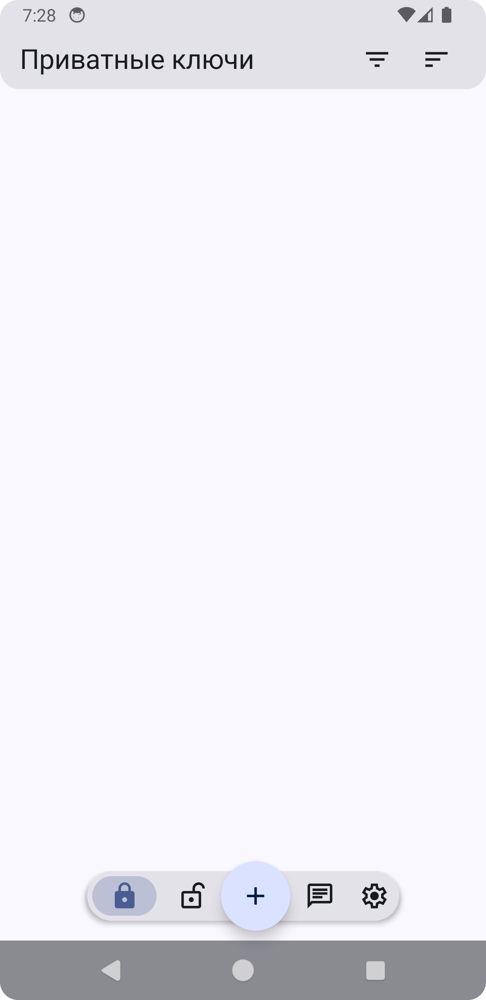
2) __Нажмите кнопку со значком "+"__
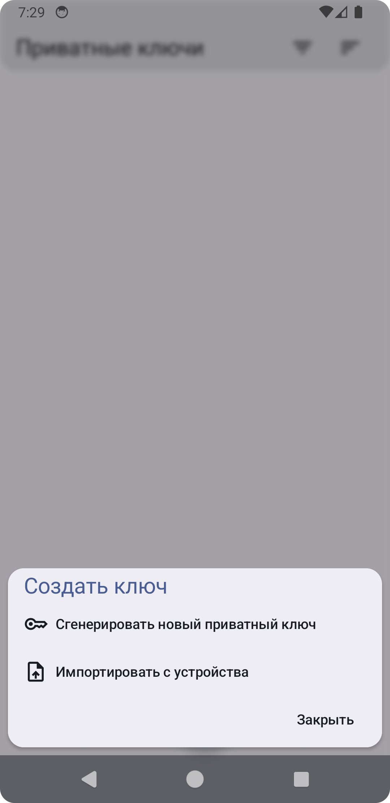
3) __Выберете пункт "Сгенерировать новый приватный ключ"__
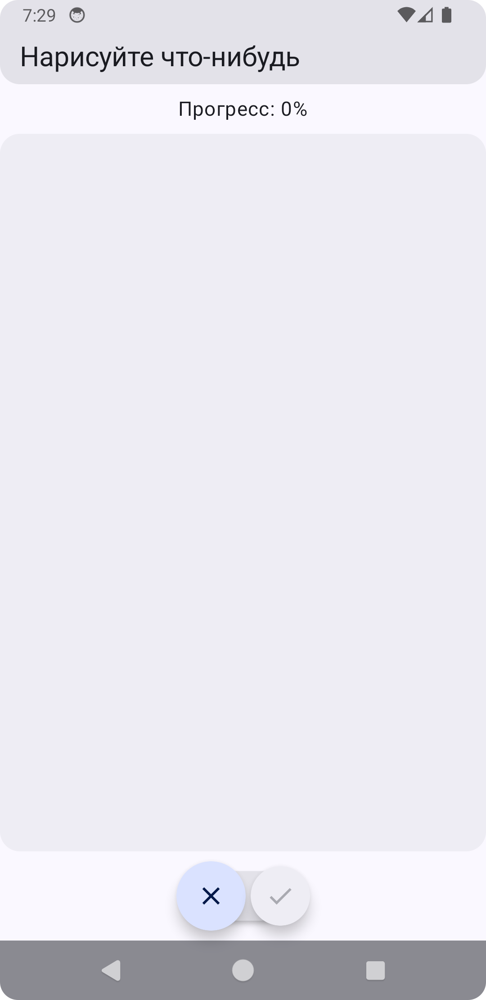
4) __Вам необходимо нарисовать что угодно пока не будет достигнут прогресс в 100%, даже каракули__
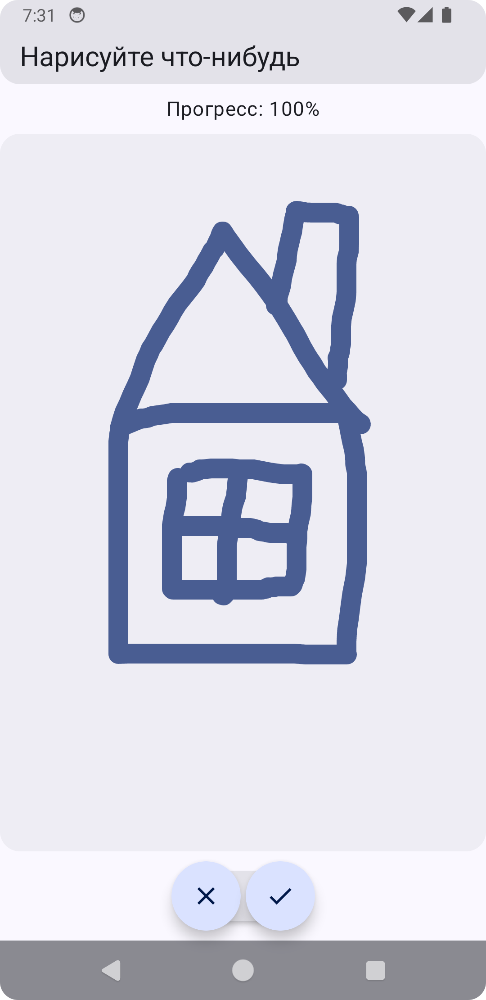
5) __Нажмите кнопку со значком "галочка"__
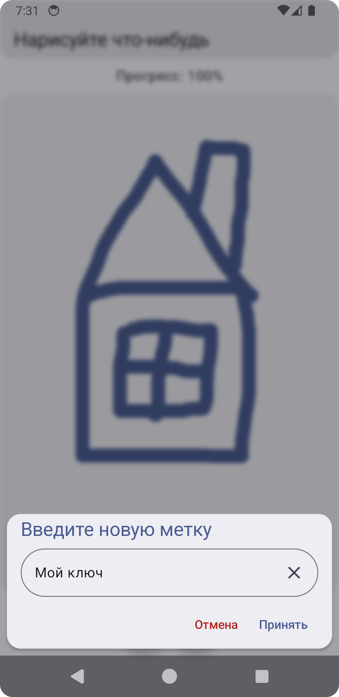
6) __Введите любое название, например "Мой ключ", и нажмите кнопку "Принять", а затем нажмите на значок "открытый замок" внизу экрана__
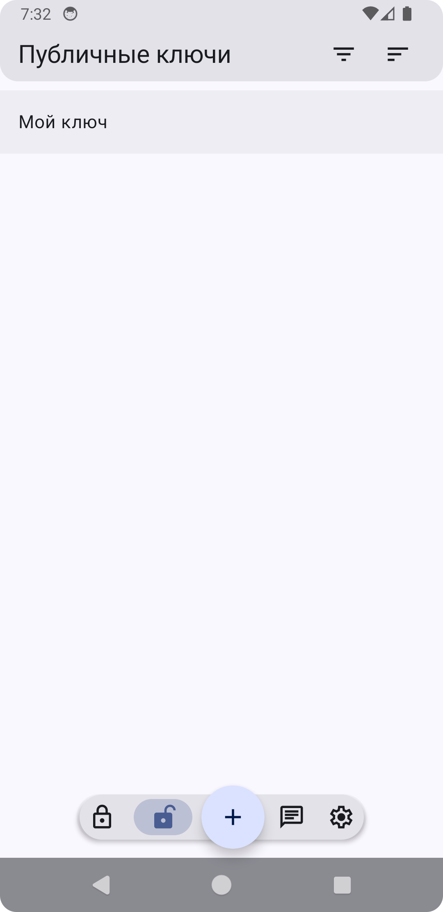
7) __Нажмите на появившейся ключ - строчка, которую Вы ввели ранее, например "Мой ключ"__
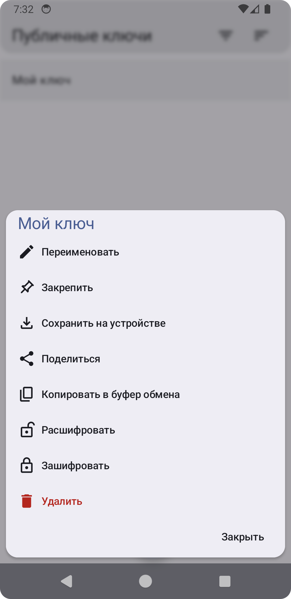
8) __Выберете пункт "Поделиться"__
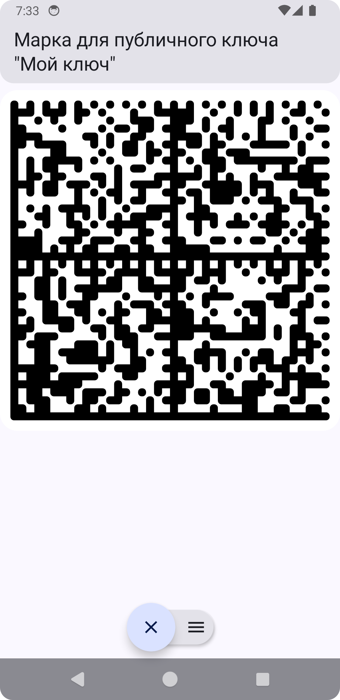
9) __Нажмите кнопку с тремя полосками (меню)__
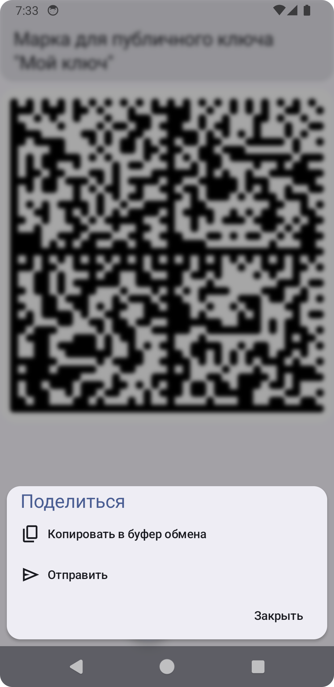
10) __Выберете пункт "Копировать в буфер обмена"__
11) __Отправтье скопированный текст Вашему администратору(мне, Егору) любым доступным способом: мессенджер, СМС, почта__

### Получение сообщений от администратора
1) __Нажмите на Ваш ключ (тот, что Вы создали ранее, например "Мой ключ")__

2) __Выберете пункт "Расшифровать"__
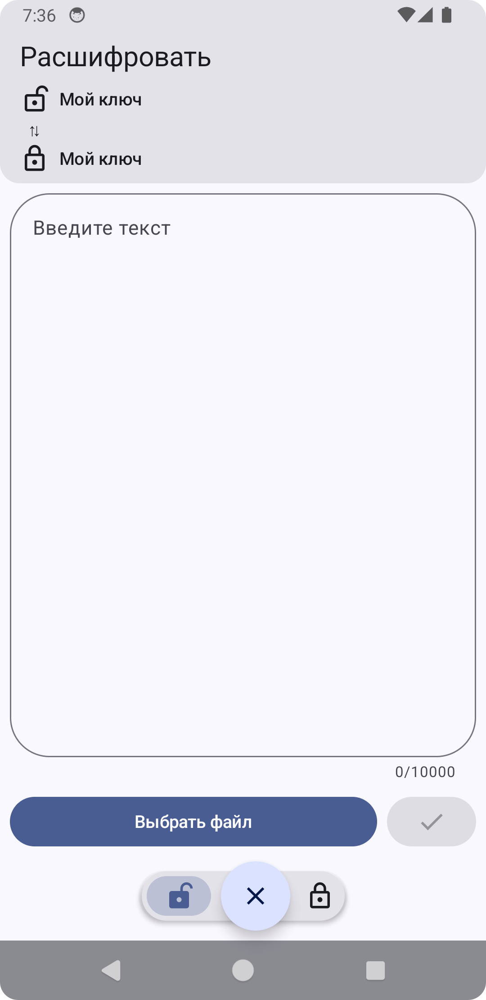
3) __Скопируйте сообщение от администратора и вставьте в поле "Введите текст"__
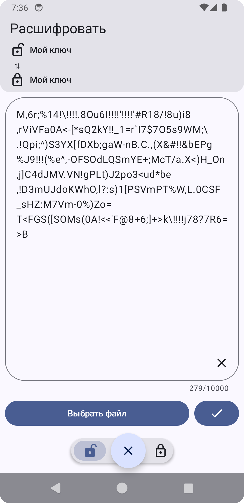
4) __Нажмите кнопку со значком "галочка"__
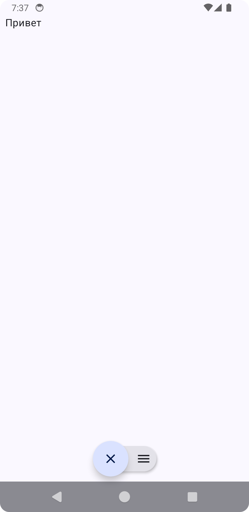
5) __Также Вы можете нажать кнопку с тремя полосками (меню) и скопировать текст для дальнейшего использования__
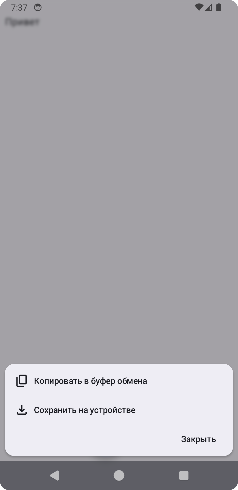
